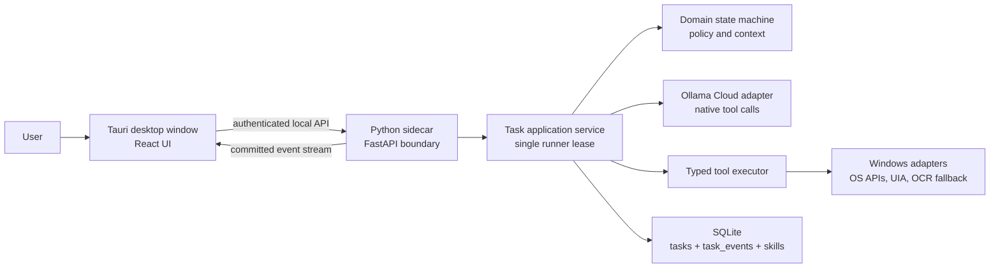

# JARVIS Final Handoff Brief

**Status:** Architectural source of truth for the JARVIS rebuild.

This document replaces prior rebuild drafts and addenda for implementation purposes. It defines the v1 product boundary, architecture, safety model, acceptance gates, and coding-agent operating rules. The implementation agent may improve internals only when the behavior and acceptance tests remain unchanged. It must obtain owner approval before a material change to scope, permissions, privacy, or user-visible behavior.

## 1. Product and boundary

JARVIS is a Windows 10/11 personal desktop assistant. A user opens a calm local dashboard, submits typed or voice requests, watches a single durable task run through visible actions, can stop it, and receives either verified results or an honest explanation of failure/uncertainty.

JARVIS is not a shell, browser agent, Windows service, background monitor, autonomous scheduler, multi-agent system, remote-control service, or self-modifying coding system.

### V1 capabilities

- Typed chat, dashboard timeline, task card, settings, microphone toggle, stop button, and local final-result TTS.
- Voice while the visible dashboard is open and voice mode is on: local VAD, local segment STT, editable near-live segment transcript, optional automatic submission, and local spoken `stop` detection.
- Ollama Cloud as the primary LLM provider, using native tool calls.
- Direct read-only system tools: time/date, battery, disk, processes, and active window.
- Scoped file tools, registered-application launch/focus/close, and exact-package `winget` install/uninstall/list/search.
- Basic GUI interaction with visible, medium-integrity native desktop applications using UI Automation first and targeted OCR/coordinates only as fallback.
- Durable SQLite task state, immutable local task events, cancellation, restart recovery, verification, explicit declarative skills, and proposed-skill review.

### Explicit v1 exclusions

- Browser-page automation, browser drivers, and browser autonomy.
- Terminal shells, PowerShell/CMD, Run dialogs, developer consoles, arbitrary executable paths/arguments, and model-created code.
- Elevated UI, UAC, secure desktop, credentials, MFA, CAPTCHA, security dialogs, security software, registry, boot configuration, and protected system locations.
- Ambient listening, tray daemon, clipboard capture, filesystem watchers, automatic monitoring/scheduling, passive preference inference, and automatic skill enablement.
- Connectors such as email, calendar, and messaging; remote access; mobile; cross-device control; vector-memory systems; cloud screenshots/vision by default.

## 2. Architectural shape



### Ownership rules

- The React dashboard presents state and submits user intent. It never automates Windows, opens files, launches processes, or executes tools.
- The Tauri core starts one fixed Python sidecar and registers the global stop shortcut. Do not expose Tauri shell/process execution to frontend code.
- The sidecar owns the authenticated local API and the application service.
- The task runner is the only component that changes task state or appends task events.
- The tool executor performs exactly one bounded action. It does not plan, call the model, write task state, or decide policy.
- The model selects a permitted next decision; it never executes an action or becomes a source of truth.

### Local boundary

- Package React assets into the Tauri window; the Vite server exists only for development.
- Tauri starts one packaged Python sidecar. It passes a random, per-launch control token to the sidecar and receives the sidecar's ephemeral loopback port through a startup handshake.
- The sidecar binds only to `127.0.0.1`, requires the token for all HTTP/WebSocket requests, validates the packaged-app origin, and never exposes a LAN listener.
- Tauri shell, spawn, execute, and generic filesystem capabilities remain denied to the frontend. The fixed sidecar launch is the only allowed child-process capability.
- Enforce a single-instance/profile lock. On shutdown, terminate the sidecar cleanly; on next launch, recover stale task leases safely.

## 3. Durable task ledger

Store local data under the current user's local application-data directory with user-only Windows ACLs. Do not use network/sync folders. Do not claim encryption at rest unless it is actually implemented. Secrets never enter SQLite, task events, normal logs, or exports.

Use one SQLite database in WAL mode with short transactions. WAL permits concurrent reads but only one writer; it does not replace the runner lease.

### Required data model

- `tasks`: current task projection: UUID, original request, normalized goal, state, version, active action ID, selected pinned skill version, pending question, final result, timestamps, and terminal reason.
- `task_events`: immutable, monotonically sequenced facts: request, decision accepted, policy result, observation, action started, execution result, verification result, cancellation, and terminal transition.
- `runner_lease`: one profile-wide lease with owner nonce, process ID, heartbeat, and expiry.
- `skills` and `skill_versions`: declarative definitions, state, versioning, and validation results.
- `settings_metadata`: non-secret settings only.

`tasks` is the current-state projection and `task_events` is the audit/event source. The task runner writes both in one transaction; no second history, queue, or audit state machine may exist. A hash chain may detect accidental modification, but must not be described as tamper-proof.

### State machine

```text
created -> running -> waiting_for_user -> running
created -> running -> completed
created -> running -> failed
created -> running -> cancelled
created/running/waiting_for_user -> interrupted  (sidecar restart/crash)
interrupted -> running                            (explicit resume only)
```

There is no `blocked` task state in v1. A remediable requirement becomes `waiting_for_user` with a precise question; a non-remediable condition becomes `failed`. `blocked`, `uncertain`, and `cancellation_pending` are action-event outcomes.

### Task ownership and idempotency

- Only one task may be `running` per local profile. There is no v1 queue.
- Multiple tasks may be `waiting_for_user`. The dashboard requires the user to choose a task before replying.
- A new request while a task runs returns `TASK_ACTIVE` with the active ID. It is never silently queued, appended, or treated as a correction.
- A correction while a task runs requires stop plus a replacement request. A clarification answer uses `POST /tasks/{id}/reply` and continues that same task.
- User-created requests include an idempotency key. The database lease and optimistic task version prevent duplicate work across retries or restarts.
- Do not keep a SQLite transaction open while waiting for the Cloud model, observing UI, executing an OS call, or verifying a result.

### Recovery and cancellation

- Before any mutating operation, commit `action_started` with an attempt ID, redacted target/effect, and action signature.
- After a crash, a started but uncompleted action is `uncertain`; the task is `interrupted`. Resume first re-observes actual state and never reruns that action blindly.
- Persist cancellation immediately. Check it after policy/preconditions and directly before the OS call. No subsequent action may begin once cancellation is accepted.
- Emit `cancellation_pending` while an atomic action finishes. Then emit an evidence-based partial result and transition to `cancelled`.
- Observations cancel immediately; GUI permits one atomic interaction then stops; file batches cancel between items; atomic write cancels before replace; package cancellation inspects state afterward and reports partial/unknown honestly.

## 4. Cloud model contract

Ollama Cloud is the default provider. Use the official direct Cloud base URL `https://ollama.com`; the adapter constructs the API path. The API key belongs in Windows Credential Manager or equivalent DPAPI-backed secret storage, never in `.env` for production.

At onboarding, query the authenticated provider model list and let the owner select an exact returned model ID. Do not hard-code a `:cloud` suffix, because local-Ollama and direct-Cloud model identifiers can differ. MiniMax M3 is an appropriate candidate only after it appears in that model list and passes capability checks.

The adapter maintains a tested provider capability profile. Before the provider is usable, a non-mutating health check must prove authentication, selected-model availability, and exactly one valid native tool call using a fake read-only tool. JSON-schema structured output is optional for providers that prove it; Cloud mode must not require it.

### Model decisions

For native-tool Cloud mode, expose only:

- a small policy-filtered subset of typed action tools;
- `request_user_input(question, required_fields)`;
- `run_skill(skill_id, inputs)`;
- `complete_task(summary, warnings)`;
- `fail_task(code, user_message)`.

Every call has a Pydantic schema. Exactly one decision is allowed per model turn. Parallel calls, unknown tools, malformed arguments, and free text without a control/action call are invalid decisions. Permit at most two repair requests with no OS side effect, then fail with `MODEL_DECISION_INVALID`.

`complete_task` is accepted only if all declared mutating effects have confirmed verifiers and no cancellation, unresolved failure, or uncertain attempt remains. The model cannot narrate success into existence. The result card and TTS are assembled from recorded evidence; optional model wording may shorten them but cannot introduce facts.

Discard model thinking/reasoning fields. Never persist, display, audit, or reintroduce them into context.

Give the model only the current durable task summary, redacted completed-step summaries, at most two recent conversation pairs for wording, minimal task-relevant UI/system context, enabled skill summaries, and permitted tool schemas. Treat all webpage, document, OCR, and screen text as untrusted data.

Each task has caps for actions, Cloud requests, input tokens, output tokens, elapsed time, and repair attempts. Cloud outage, rate limit, unavailable/retired model, malformed decision, or exhausted budget results in honest failure/waiting behavior; never silently switch to a local model or repeat a possibly mutating decision.

Tool output has three views: bounded redacted `model_summary`, redacted audit/event data, and optional local artifact reference. Never pass full directories, raw UI trees, screenshots, unlimited process output, or unrelated file contents to the model. File content may be Cloud-bound only when the user directly asks to read/summarize/transform one identified file, and then only as a bounded text extraction with the Cloud disclosure visible.

## 5. Tools, policy, and verification

Every action has a Pydantic input/output schema, target-aware deterministic policy, non-mutating preconditions, bounded executor, fresh verifier, cancellation class, and recovery note. Output includes `success`, structured `data`, structured `error`, redacted `evidence`, and `duration_ms`.

Policy is authoritative. The model's risk label or rationale cannot override it. A direct, sufficiently specific user instruction runs without a routine second confirmation; ambiguous targets, recipients, package IDs, file sets, or external commitments require clarification.

### Tool set

| Category | V1 operations | Required verification |
|---|---|---|
| System read | time/date, battery, disk, processes, active window | Direct OS evidence |
| Files | list/read/create/write/move/copy/delete in approved roots | Fresh path/content/metadata read-back |
| Applications | list installed applications, launch, focus, close | Registered identity plus process/window state |
| Packages | `winget` search/list/install/uninstall | Exact package ID plus `winget list`/app-presence evidence |
| GUI observe | active window, bounded UIA query, bounded OCR region, screenshot reference | Fresh timestamp and target identity |
| GUI act | focus, UIA invoke/value, single coordinate click/type/hotkey/scroll fallback | Expected fresh window/element/value state |
| Control | cancel current task | Cancellation token/event recorded |

### Direct system and file rules

- Direct OS APIs come before GUI work. System state is not parsed from shell output.
- File roots are canonical configured user roots. V1 rejects traversal, reparse points/symlinks/junctions, wildcards, implicit recursion, and bulk selection. Recheck the final handle target before mutation.
- Deletion uses Recycle Bin when compatible and records recoverability. Overwrite, move, deletion, and package uninstall require exact resolved targets.
- Application launch uses registered application identity, never a model-supplied executable path or command line. An unsaved-work prompt becomes `waiting_for_user`; never choose Save or Discard without explicit instruction.
- `winget` is the only command-line subprocess tool. It uses a fixed argument array, exact ID, and approved source. A name search shows choices; it never guesses or auto-accepts package/source agreements or elevation.

### GUI rules

- GUI v1 is limited to visible, foreground, medium-integrity native desktop applications. It does not automate browser page content.
- Run UI Automation calls in one dedicated background COM MTA worker, never on FastAPI's event loop or the dashboard UI thread. Do not pass live UIA handles between threads; reacquire targets from fresh evidence.
- Select a unique fresh UIA element and use its native pattern first. If unavailable, use a targeted OCR/visual observation no older than five seconds.
- Coordinates use physical pixels after per-monitor DPI normalization, focus the expected window, perform one interaction, then re-observe. Never guess a second click.
- Locked session, missing target, stale target, changed window, elevated target, UAC, or security surface return structured failed/uncertain/needs-elevation outcomes without interaction.
- JARVIS remains a standard-user app in v1. It does not use UIAccess, elevate itself, automate UAC, or control elevated processes.

## 6. Voice, privacy, and local data

The visible dashboard owns microphone permission/capture. Voice capture is active only while the dashboard is visible and voice mode is on; it stops on close, minimize, lock, permission loss, or toggle off. The frontend sends short PCM frames through the authenticated local connection. The sidecar performs local VAD and local STT on completed segments.

V1 transcript is near-live: an editable draft appears at segment completion. Do not promise word-by-word interim transcription. A local check of the completed STT text recognizes the stop phrase before normal task submission, even when auto-submit is disabled. The trusted Tauri core also owns the configurable global stop shortcut and directly requests cancellation; it does not depend on React, STT, or the Cloud model.

Raw audio is deleted after transcription unless a separate recording setting is enabled. TTS is local/offline and speaks only the concise evidence-based final result.

Choose one STT model and one TTS voice in Phase -1, pin their version/license/checksum, and either bundle them in the signed installer or offer an explicit owner-initiated verified download. Never download them on import or application startup.

Redact before persistence and before Cloud transmission. Default exclusions include secrets, password fields, security dialogs, browser address/query text, raw screenshots, raw OCR trees, raw audio, and model thinking. Screenshot/Cloud vision sharing is not a v1 capability; do not show an active sharing toggle until a future approved Cloud vision adapter exists.

Task/audit retention is owner-configurable; recommended default is 90 days. Append-only means no in-place edits during retention, not forever. Purge deletes complete expired records and emits a non-sensitive purge receipt. Preferences remain until the owner edits or deletes them.

## 7. Skills and memory

A skill is a versioned declarative workflow, never executable Python/model code. It uses registered tools only and a restrictive reference grammar: `inputs.<field>` and `steps.<step_id>.output.<field>`. It has no arbitrary templates, expression evaluator, branches, loops, or secret values in v1.

Each skill step uses normal policy, preconditions, execution, verification, persistence, cancellation, and retry behavior. A running task pins the validated skill version. Disabling a skill prevents its next unstarted step and pauses the task with an explanation.

A proposed skill may be generated only after two materially similar successful traces. The proposal must redact concrete user data, parameterize changing inputs, include verifiers, avoid coordinates, validate deterministically, and require explicit user enablement. Manual skills use the same validator.

Memory is limited to recent conversation wording, durable task state/events, and explicit user preferences with source/edit/delete controls. No vector database, passive profile inference, or background memory writer belongs in v1.

## 8. Dashboard and local API

The dashboard contains:

- chat compose field, transcript preview, microphone toggle, send button, and visible Cloud/privacy state;
- red Stop button only while a task is running;
- current task goal/state/current action/action count/elapsed time/pending clarification;
- expandable event timeline with decision, action, verification, errors, and redacted evidence;
- skills pages for inspect/create/version/enable/disable/run/proposal review;
- settings for selected Cloud model, voice/TTS, approved file roots, retention, and non-secret provider configuration.

All local API routes require the per-launch token and stable request/response schemas. Required operations are task create/get/reply/cancel/resume, event replay/stream, health/system state, voice-segment ingestion, non-secret settings read/update, write-only secret-store update, and skill list/inspect/create/version/enable/disable/start.

Event fanout happens only after a task transaction commits. A slow/disconnected UI cannot block the runner. Clients reconnect using an `after_sequence` cursor and rebuild the exact timeline from durable events.

## 9. Delivery milestones

### Phase -1: architecture approval

Before implementation code, return a concise decision record and an acceptance-test map covering: task ownership, intent routing, cancellation, external state changes, recovery/undo, permissions/identity, data lifecycle, GUI reliability, tool discovery, skill lifecycle, model failure, desktop lifecycle, Cloud capability/model selection, local API trust boundary, UIA threading, and voice-asset lifecycle. Wait for owner approval.

### A: packaging and ledger spike

Tauri launches the fixed Python sidecar; authenticated loopback API works; database migration, runner lease, event transaction, and clean shutdown work. No real OS mutation.

### B: trusted text core

Typed request, Cloud capability probe, fake decision provider, one read-only system tool, evidence-based completion, cancellation, restart/interruption, and live/replayable dashboard event stream.

### C: controlled mutation

Scoped test-file create/read plus registered application launch/focus with preconditions, verifier, cancellation, and recovery.

### D: GUI competence

Only the dedicated local Windows fixture application. UIA-first targeting, OCR fallback, stale/missing-target failure, and no browser-page automation.

### E: voice and dashboard completion

Local VAD/STT/TTS, editable segment transcript, local/global stop, privacy UX, full settings, and audit viewer.

### F: skills and release hardening

Declarative skills, proposals, retention/purge, installer lifecycle, clean-machine verification, and signing/distribution plan.

Do not start a later milestone before the previous gate passes.

## 10. Mandatory acceptance tests

1. Plain model text cannot complete a task; only validated control/action calls can.
2. A verifier failure/uncertainty cannot be reported as successful completion.
3. Crash after `action_started` results in `interrupted` plus `uncertain`; resume re-observes before mutation.
4. Second task execution and duplicate HTTP retries cannot create duplicate work.
5. Wrong-token, wrong-origin, second-instance, or non-loopback client cannot control the sidecar.
6. Path traversal, reparse point, protected target, wildcard/bulk deletion, terminal/Run-dialog target, and model-generated command-line attempt are denied without side effect.
7. Locked, disconnected, elevated, stale, or missing GUI target receives no click/keypress.
8. Cloud malformed decision, rate limit, outage, stale model ID, retirement, and budget exhaustion cause no guessed/repeated side effect and no silent local fallback.
9. Audit and Cloud-bound context exclude secrets, password text, browser address/query text, raw audio/screenshots/OCR trees, and model thinking.
10. Slow event clients cannot delay a tool action; reconnect reconstructs an identical sequence of events.
11. UIA work runs only on the dedicated worker and model context cannot contain unlimited directory/UI results.
12. Voice assets do not download automatically; explicit install verifies pinned version/checksum.
13. Clean interactive Windows test machine installs, launches, cancels, restarts, upgrades/uninstalls safely, and leaves no orphan sidecar or corrupt ledger.

## 11. Coding-agent operating rules

1. Read this document before code changes and keep an implementation plan.
2. Work one milestone at a time. Do not begin a later milestone before its gate passes.
3. Do not add a dependency without stating the requirement it meets and why a smaller/standard alternative is insufficient.
4. Do not paper over errors, suppress failed tests, claim unexecuted checks, or call desktop mutation best effort.
5. Return structured failure/uncertainty for unsafe or unverifiable actions.
6. Add a regression test before or alongside every bug fix.
7. Keep modules cohesive; split any component that coordinates UI, storage, policy, model calls, and execution.
8. Record deliberate architecture changes in `docs/architecture.md` and wait for owner approval when they alter behavior, scope, permissions, or privacy.
9. Never introduce autonomous monitoring, queueing, browser automation, shell access, an extra agent, vector memory, or self-authored executable skills as a shortcut.

## Definition of done

V1 is done only when a user can open the packaged dashboard, issue a typed or spoken request, watch one durable task progress through visible actions, receive verified results or honest failure, stop it safely, inspect its audit history, resume a clarification using the same task ID, and enable a validated proposed skill. All mandatory acceptance tests must pass on a clean interactive Windows test machine.

